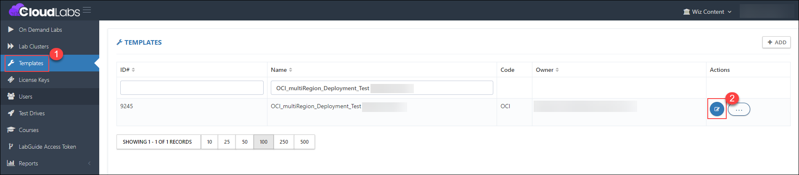
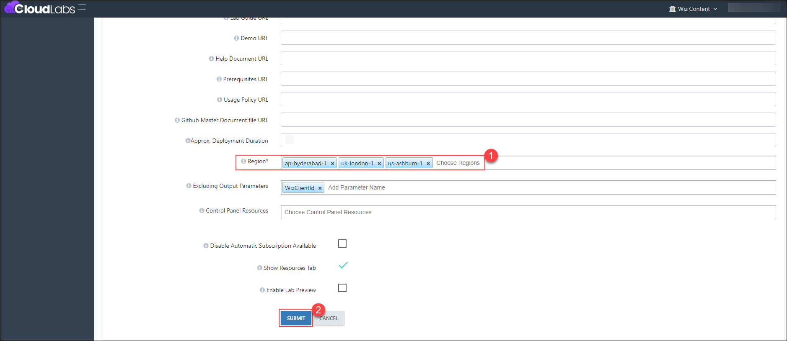
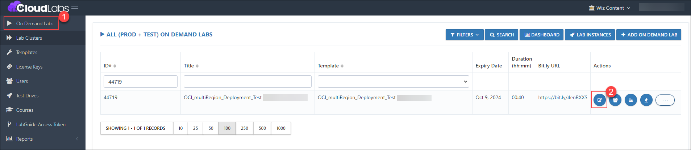
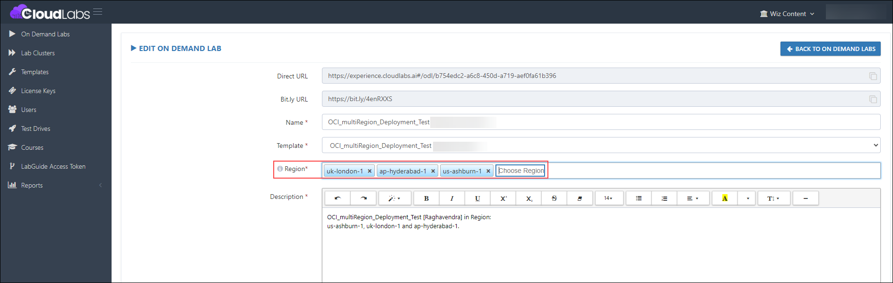
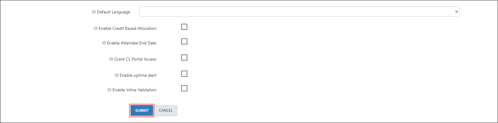
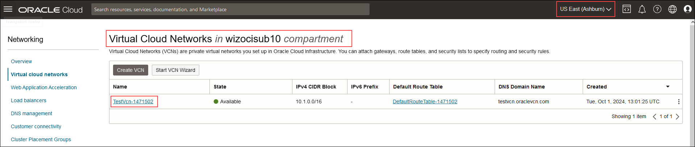
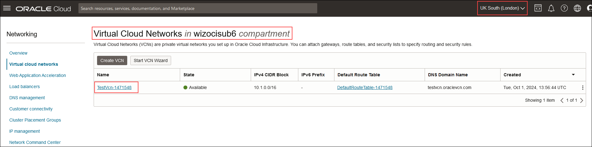
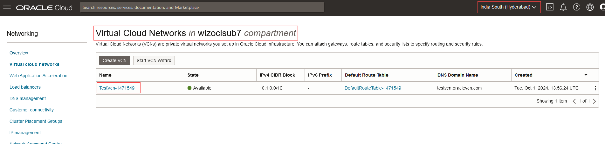

# Multi-region deployment using OCI

### Overview

Users can now deploy OCI resources in multiple regions. Currently, it is limited to **us-ashburn-1, uk-london-1,** and **ap-hyderabad-1.**

### Prerequisites

- Before adding multiple regions to the template, ensure you have the following prerequisite:
  
  Admin access to [CloudLabs Admin Portal](https://admin.cloudlabs.ai/) (If access is unavailable, kindly reach out to your point of contact or [CloudLabs Support](https://docs.cloudlabs.ai/RequestSupport)).

### Adding Multiple Region 

1. Log in to the CL portal and navigate to the required tenant (WIZ). On the left-hand side of the page, you will see the Template section.

2. Navigate to the **Templates (1)** section in the left menu and click on the **edit (2)** button.

   

3. Scroll down to the **Region (1)** section and choose the regions. Then click on the **Submit (2)** button.

   

4. Navigate to the **ODL (1)** section in the left menu and click on the **edit (2)** button.

   

5. After clicking on the edit button, choose the same regions that were updated at the template level.

   

6. Then scroll down and click on the **Submit** button.

   

### Testing scenario:

Once the users are deployed, below are the outputs for all the regions with resources deployed in each region.

- us-ashburn-1

     

-  uk-london-1

     

- ap-hyderabad-1

     
